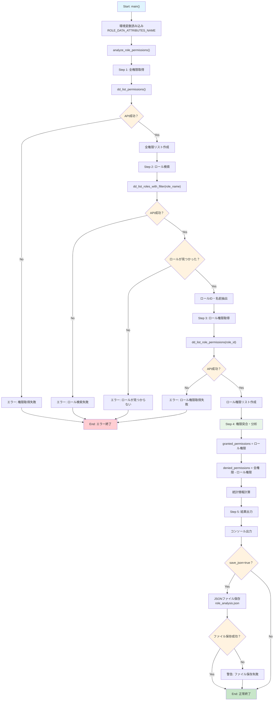

# Datadog Role Information

Datadogのロール情報を取得するPythonスクリプト

## 機能

- 全権限の一覧表示
- 全ロールの一覧表示
- ロール名でのフィルタリング検索
- 特定ロールの権限詳細表示
- **ロール権限分析**: 指定ロールの許可/未許可権限を分析・整理して表示

## 使用方法

### 1. 基本設定

環境変数を設定:
```bash
export DD_SITE="https://api.datadoghq.com"  # リージョンに応じて変更
export DD_API_KEY="your_api_key_here"
export DD_APP_KEY="your_app_key_here"
export ROLE_DATA_ATTRIBUTES_NAME="Datadog Admin Role"
```

**注意**: DD_SITEの値はDatadogのリージョン（サイト）によって異なります。  
詳細は[Datadogサイトのドキュメント](https://docs.datadoghq.com/ja/getting_started/site/#datadog-%E3%82%B5%E3%82%A4%E3%83%88%E3%81%AB%E3%82%A2%E3%82%AF%E3%82%BB%E3%82%B9%E3%81%99%E3%82%8B)を参照してください。

### 2. デバッグモード（オプション）

JSONファイル出力を有効にする場合:
```bash
export DEBUG=true
```

### 3. 機能別設定

#### ロール名フィルタリング
```bash
export ROLE_DATA_ATTRIBUTES_NAME="Datadog Admin Role"
```

#### 特定ロールの権限表示
```bash
export ROLE_DATA_ID="12345678-1234-1234-1234-123456789abc"
```

### 4. スクリプト実行
```bash
python datadog_roles.py
```

## ロール権限分析機能

メイン機能として、指定されたロールの権限を詳細分析します：

1. 組織情報を取得
2. 指定ロール名から該当ロールを検索
3. 全権限一覧と突合して許可/未許可権限を分類
4. 統計情報と共に結果を表示
5. save_json=trueの場合、詳細結果をJSONファイルに保存

### 実行例
```bash
# Datadog Admin Roleを分析（JSONファイル出力あり）
export ROLE_DATA_ATTRIBUTES_NAME="Datadog Admin Role"
python datadog_roles.py

# デバッグモードも有効にする場合
export DEBUG=true
export ROLE_DATA_ATTRIBUTES_NAME="Datadog Admin Role"
python datadog_roles.py
```

### 出力例
```
Analyzing role: Datadog Admin Role
Found role: Datadog Admin Role (ID: 12345678-1234-1234-1234-123456789abc)

=== Role Analysis Results ===
Role: Datadog Admin Role
Total permissions: 150
Granted: 150
Denied: 0
Analysis result saved to role_analysis.json
```

## 処理フロー



## Datadogのロールと権限について

Datadogでは、ユーザーのアクセス制御にロールベースアクセス制御（RBAC）を使用しています：

- **ロール**: ユーザーに割り当てられる権限のセット
- **権限**: 特定の機能やリソースへのアクセス権
- **標準ロール**: Datadog Admin Role、Datadog Standard Role、Datadog Read Only Role
- **カスタムロール**: 組織のニーズに合わせて作成可能

## エラーハンドリング

- **ApiException**: Datadog API固有のエラー
- **Exception**: 一般的な予期しないエラー
- **KeyError/TypeError**: データ構造処理エラー
- **IOError/OSError**: ファイル操作エラー
- **パストラバーサル対策**: ファイル名の安全化処理

## 参考情報

- [Datadog API リファレンス](https://docs.datadoghq.com/ja/api/latest/?tab=python)
- [Roles API ドキュメント](https://docs.datadoghq.com/api/latest/roles/#list-roles)
- [Postman Collection](https://god.gw.postman.com/run-collection/20651290-809b13c1-4ada-46c1-af65-ab276c434068?action=collection%2Ffork&source=rip_markdown&collection-url=entityId%3D20651290-809b13c1-4ada-46c1-af65-ab276c434068%26entityType%3Dcollection%26workspaceId%3Dbf049f54-c695-4e91-b879-0cad1854bafa)
- [Datadogのロールと権限について](https://docs.datadoghq.com/ja/account_management/rbac/)

